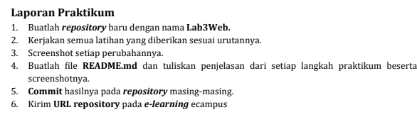
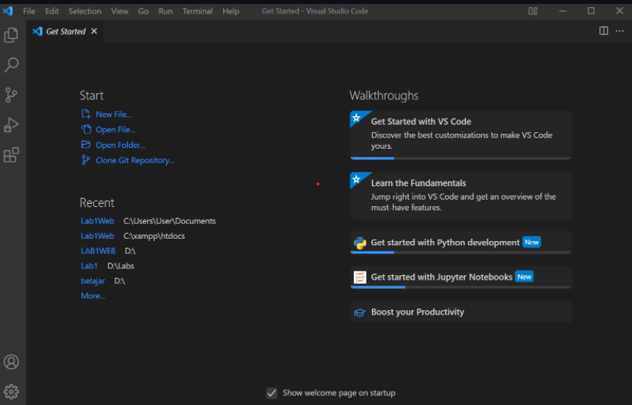
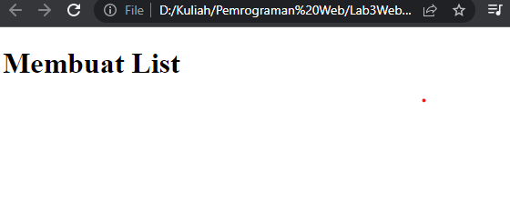
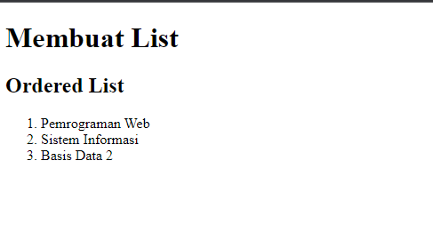
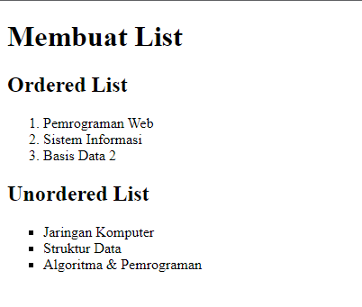
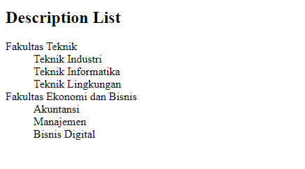
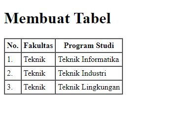
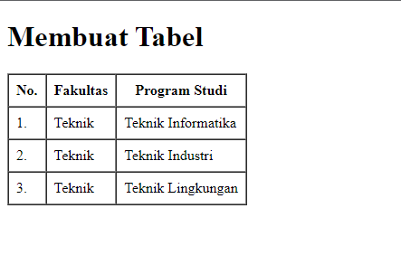
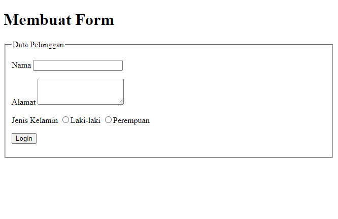

# Lab3Web

**Nama  : Fery Affandi**  
**NIM   : 312010018** 
**Kelas : TI.20.A.1** 

## Praktikum 3

Gambar 3.1

### Langkah-langkah praktikum 

Buka text editor yang anda punya, contohnya Visual Studio Code

Gambar 3.2
 

Persiapan membuat dokumen html dengan nama file <b>lab3_list.html</b> seperti berikut

Gambar 3.3

dan hasil di webnya akan seperti ini.

Gambar 3.4

### Membuat Order List

Kemudian tambahkan kode untuk membuat Ordered List seperti berikut.

Gambar 3.5

 dan hasil di webnya akan seperti ini.

Gambar 3.6 Tampilan Orderlist

### Membuat Unorderd List

Kemudian tambakan kode untuk membuat <i>Unordered List</i>, setelah deklarasi 
ordered list pada section <b>unordered-list</b>, seperti berikut.

Gambar 3.7

dan hasil di webnya akan seperti ini.

Gambar 3.8 Tampilan Unorder List

### Membuat Description List

Kemudian tambahkan kode untuk membuat description list setelah 
deklarasi unorderd-list.

Gambar 3.9

dan hasil di webnya akam seperti ini

Gambar 3.10 Tampilan Description List

### Membuat Tabel

Buat file baru dengan nama <b>lab3_tabel.html</b> seperti berikut.

Gambar 3.11

Kemudian selanjutnya tambahkan kode untuk membuat tabel 
sederhana seperti berikut:

Gambar 3.12

dan hasil pada web nya akan seperti ini.

Gambar 3.13 Membuat Tabel

### Mengatur Margin dan Padding

Untuk mengatur margin dan padding pada cel data, tambahkan atribut 
<b>cellpadding</b> dan <b>cellspacing</b> pada tag table.

Gambar 3.14

hasilnya seperti ini.

Gambar 3.15 Penggunaan Cellspadding

### Menggabungkan Sel Data

Untuk menggabungkan sel data, gunakan atribut rowspan dan colspan. Atribut 
rowspan untuk menggabungkan baris (secara vertikal) dan colspan untuk 
menggabungkan kolom (secara horizontal).

Gambar 3.16

dan hasilnya akan seperti ini

Gambar 3.17 Penggabungan Sell

### Membuat Form

Buat file baru dengan nama <b>lab3_form.html</b> seperti berikut.

Gambar 3.18

Kemudian selanjutnya tambahkan kode untuk membuat tabel sederhana seperti berikut:

Gambar 3.19

dan hasilnya akan seperti ini.

Gambar 3.20 Membuat Form.

### Menambahkan Style pada form

Agar tampilan form lebih menarik, bisa ditambahkan CSS seperti berikut.

