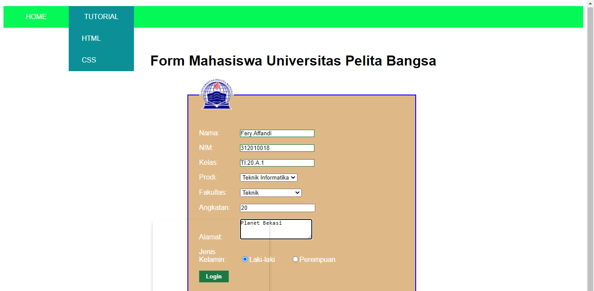

# Lab3Web

**Nama  : Fery Affandi** <br>
**NIM   : 312010018**<br>
**Kelas : TI.20.A.1**<br>

## Praktikum 3


<p align="center">Gambar 3.1

### Langkah-langkah praktikum 

Buka text editor yang anda punya, contohnya Visual Studio Code


<p align="center">Gambar 3.2
<br>

Persiapan membuat dokumen html dengan nama file <b>lab3_list.html</b> seperti berikut


<p align="center">Gambar 3.3

dan hasil di webnya akan seperti ini.


<p align="center">Gambar 3.4

### Membuat Order List

Kemudian tambahkan kode untuk membuat Ordered List seperti berikut.


<p align="center">Gambar 3.5

 dan hasil di webnya akan seperti ini.


<p align="center">Gambar 3.6 Tampilan Orderlist

### Membuat Unorderd List

Kemudian tambakan kode untuk membuat <i>Unordered List</i>, setelah deklarasi 
ordered list pada section <b>unordered-list</b>, seperti berikut.


<p align="center">Gambar 3.7

dan hasil di webnya akan seperti ini.


<p align="center">Gambar 3.8 Tampilan Unorder List

### Membuat Description List

Kemudian tambahkan kode untuk membuat description list setelah 
deklarasi unorderd-list.


<p align="center">Gambar 3.9

dan hasil di webnya akam seperti ini


<p align="center">Gambar 3.10 Tampilan Description List

### Membuat Tabel

Buat file baru dengan nama <b>lab3_tabel.html</b> seperti berikut.


<p align="center">Gambar 3.11

Kemudian selanjutnya tambahkan kode untuk membuat tabel 
sederhana seperti berikut:


<p align="center">Gambar 3.12

dan hasil pada web nya akan seperti ini.


<p align="center">Gambar 3.13 Membuat Tabel

### Mengatur Margin dan Padding

Untuk mengatur margin dan padding pada cel data, tambahkan atribut 
<b>cellpadding</b> dan <b>cellspacing</b> pada tag table.


<p align="center">Gambar 3.14

hasilnya seperti ini.


<p align="center">Gambar 3.15 Penggunaan Cellspadding

### Menggabungkan Sel Data

Untuk menggabungkan sel data, gunakan atribut rowspan dan colspan. Atribut 
rowspan untuk menggabungkan baris (secara vertikal) dan colspan untuk 
menggabungkan kolom (secara horizontal).


<p align="center">Gambar 3.16

dan hasilnya akan seperti ini


<p align="center">Gambar 3.17 Penggabungan Sell

### Membuat Form

Buat file baru dengan nama <b>lab3_form.html</b> seperti berikut.


<p align="center">Gambar 3.18

Kemudian selanjutnya tambahkan kode untuk membuat tabel sederhana seperti berikut:


<p align="center">Gambar 3.19

dan hasilnya akan seperti ini.


<p align="center">Gambar 3.20 Membuat Form.

### Menambahkan Style pada form

Agar tampilan form lebih menarik, 
bisa ditambahkan file css dan menuliskan kode seperti berikut.


<p align="center">Gambar 3.21 

lalu refresh dan lihat perubahannya pada web.


<p align="center">Gambar 3.22 Form dengan CSS.

## Pertanyaan dan Tugas

Buatlah form yang menampilkan `dropdown` menu dan `listbox` dengan <b><i>multiple selection</i></b>

## Jawaban

membuat dropdown menu dan listbox dengan multiple selection menggunakan text editor VScode <br>

1. Buat file dengan nama <b>form_dropdown.html</b> 
2. Lalu buat codingan HTMLnya seperti ini 

```
<!DOCTYPE html>
<html lang="en">
<head>
    <meta charset="UTF-8">
    <meta http-equiv="X-UA-Compatible" content="IE=edge">
    <meta name="viewport" content="width=device-width, initial-scale=1.0">
    <title>Form Dropdown</title>
    <!-- menyisipkan css -->
    <link rel="stylesheet" href="dropdown_style.css"
</head>
<body>
    <div class="menu-wrap">
        <ul>
            <li><a href="https://ecampus.pelitabangsa.ac.id/">Home</a></li>
            <li><a href="https://github.com/Vinez1">Tutorial</a>
        <ul>
            <li><a href="https://github.com/Vinez1/WebLab1">HTML</a></li>
            <li><a href="https://github.com/Vinez1/Lab2Web">CSS</a></li>
        </ul>
        </ul>
        </div>
    <header>
        <h1><b><br>Form Mahasiswa Universitas Pelita Bangsa</b></h1>
    </header>
    <form action="proses.php" method="post">
        <fieldset>
            <legend></legend>
            <p>
                <label for="nama">Nama:</label>
                <input type="text" id="nama" name="nama">
            </p>
            <p>
                <label for="nim">NIM:</label>
                <input type="text" id="nim" name="nim">
            </p>
            <p>
                <label for="kelas">Kelas:</label>
                <input type="text" id="kelas" name="kelas">
            </p>
            <p>
                <label for="prodi">Prodi:</label>
                <select name='prodi'size=1 multiselect>
                    <option value='' selected>Pilih Prodi</option>
                    <option value='Teknik Informatika'>Teknik Informatika</option>
                    <option value='Teknik Industri'>Teknik Industri</option>
                    <option value='Teknik Sipil'>Teknik Sipil</option>
                </select>
            <p>
                <label for="fakultas">Fakultas:</label>
                <select name="ddl" size=1 multiselect>
                    <option value='' selected>Pilih Fakultas</option>
                    <option value='FEB'>Ekonomi dan Bisnis</option>
                    <option value='FH'>Hukum</option>
                    <option value='FAI'>Agama Islam</option>
                    <option value='FT'selected='selected'>Teknik</option>
                </select>
            </p>
            <p>
                <label for="angkatan">Angkatan:</label>
                <input type="angka" id="angkatan" name="angkatan">
            </p>
            <p>
                <label for="alamat">Alamat:</label>
                <textarea id="alamat" name="alamat" cols="20" rows="3"></textarea>
            </p>
            <p>
                <label>Jenis Kelamin:</label>
                <input id="jk_l" type="radio" name="kelamin" value="L" /><label
    for="jk_l">Laki-laki</label>
                <input id="jk_p" type="radio" name="kelamin" value="P" /><label
    for="jk_p">Perempuan</label>
            </p>
            <p><input type="submit" value="Login">  
            
            
        </fieldset>
    </form> 
</body>
</html>
```
dan memasukan file css dengan format seperti ini.
```
h1{
    text-align: center;
    color: #000000;
}
form fieldset{
    border-style: solid;
    border-color: blue;   
    padding: 25px;
    background-color: burlywood;
    background-repeat: no-repeat;
    background-size: auto;
    position: absolute; 
    right: 390px;
    width: 35%; 
}
form p > label {
    display: inline-block;
    width: 90px;
}
form input[type="text"], 
form textarea {
    border: 1px solid #197a43;
}
form input[type="submit"] {
    border: 1px solid #197a43;
    background-color: #197a43;
    color: #ffffff;
    font-weight: bold;
    padding: 5px 15px;
}

* {margin: 1,5px; padding: 0px;}
 
    body {
  background-color:#fff;
  font-family:Arial, Helvetica, sans-serif;
  color:#FFF;
     }
 
     .menu-wrap {
  background-color:rgb(4, 248, 86); 
  height:50px; 
  line-height:50px; 
  position:relative;
  width:100%;
  margin:auto;
  margin-top:auto;
     }
 
   .menu-wrap ul {
  list-style:none;
     }
 
  .menu-wrap ul li a {
  float:left; 
  width:150px; 
  display:block; 
  text-align:center; 
  color:#FFF; 
  text-decoration:none; 
  text-transform:uppercase;
     }
 
  .menu-wrap ul li a:hover {
  background-color:#0b9097; 
  display:block;
     }
 
   .menu-wrap ul li:hover ul {
  display:block;
     }
 
   .menu-wrap ul ul {
  display:none; 
  list-style:none; 
  position:absolute; 
  background-color:#0b9097;
  left:150px; 
  top:50px; 
  width:150px;
     }
 
   .menu-wrap ul ul li a {
  float:none; 
  display:block; 
  padding-left:30px; 
  text-align:left; 
  width:160px;
     }
 
  .menu-wrap ul ul li a:hover {
  color:#fff;
      }
```
 dan hasil di webnya akan seperti ini.
 
 <p align="center">Gambar 3.23 Hasil jawaban


